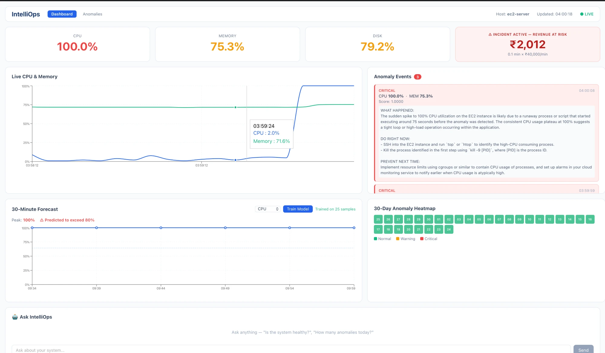
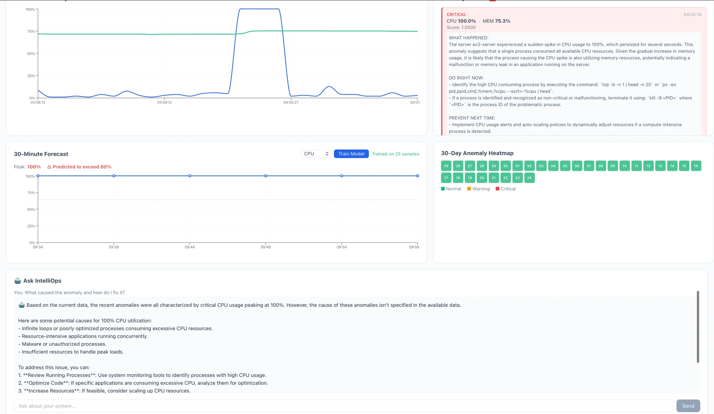

# IntelliOps — AI-Powered System Monitoring Platform

> Real-time infrastructure monitoring with ML anomaly detection, Prophet forecasting, and GPT-4o root-cause analysis. Deployed on AWS EC2.

---

## Screenshots

| Dashboard — Live Incident | AI Chat Interface | Anomaly History |
|:---:|:---:|:---:|
|  |  |  |

---

## What It Does

IntelliOps monitors your servers in real-time and uses AI to tell you *why* something broke — not just *that* it broke.

- Streams CPU, memory, disk, and network metrics every 5 seconds
- Detects anomalies and classifies severity (warning / critical)
- Calls GPT-4o to generate root-cause analysis with "fix now" steps
- Forecasts the next 30 minutes of CPU/memory usage
- Estimates business impact in ₹/minute during active incidents
- Lets you ask questions in plain English: *"Is my system healthy?"*

---

## Architecture

```
┌─────────────────────────────────────────────────────────────┐
│                        AWS EC2 (t2.micro)                   │
│                                                             │
│  ┌──────────────┐    POST /ingest    ┌───────────────────┐  │
│  │  Collector   │ ─────────────────▶ │   FastAPI + WS    │  │
│  │  (psutil)    │                    │   (uvicorn)       │  │
│  └──────────────┘                    └────────┬──────────┘  │
│                                               │             │
│                              ┌────────────────┼──────────┐  │
│                              ▼                ▼          │  │
│                       ┌─────────┐    ┌──────────────┐   │  │
│                       │InfluxDB │    │  Anomaly     │   │  │
│                       │(persist)│    │  Detector    │   │  │
│                       └─────────┘    └──────┬───────┘   │  │
│                                             │           │  │
│                                     ┌───────▼───────┐   │  │
│                                     │  GPT-4o       │   │  │
│                                     │  Explainer    │   │  │
│                                     └───────────────┘   │  │
│                                                          │  │
│  ┌─────────────────────────────────────────────────────┐ │  │
│  │              React Dashboard (port 3000)            │ │  │
│  │  Live Chart │ Anomaly List │ Forecast │ AI Chat     │ │  │
│  └─────────────────────────────────────────────────────┘ │  │
└─────────────────────────────────────────────────────────────┘
```

---

## Tech Stack

| Layer | Technology |
|-------|-----------|
| **Frontend** | React 18, TypeScript, Recharts, React Router v6 |
| **Backend** | FastAPI, Python 3.11, WebSockets |
| **ML / AI** | Scikit-learn (Isolation Forest), NumPy (forecasting), OpenAI GPT-4o |
| **Storage** | InfluxDB 2.7 (time-series), Redis (Celery broker) |
| **Task Queue** | Celery + Celery Beat |
| **Infrastructure** | AWS EC2 t2.micro, Docker, systemd |
| **CI/CD** | GitHub Actions |

---

## Features

### Real-Time Monitoring
- WebSocket stream pushes metrics every 5 seconds
- Live chart with CPU and memory trends
- Status cards with color-coded thresholds (green / amber / red)

### Anomaly Detection
- Scores each reading; flags CPU > 60% as anomalous
- Severity classification: `warning` (score 0–0.85) or `critical` (score > 0.85)
- 30-day heatmap calendar showing historical incident days

### AI Root-Cause Analysis
- GPT-4o analyses each anomaly with 10 readings of context
- Structured response: **WHAT HAPPENED / DO RIGHT NOW / PREVENT NEXT TIME**
- Expandable explanation cards in the Anomalies page

### Forecasting
- Polynomial trend model (NumPy) trained on last 24h of InfluxDB data
- Predicts next 30 minutes with confidence bands
- Train / predict via UI or API

### Business Impact Tracker
- Ticks ₹40,000/minute while an active incident is running
- Resets automatically when anomaly clears

### AI Chat Interface
- Natural language queries powered by GPT-4o
- Answers questions like *"How many anomalies in the last hour?"*

---

## Project Structure

```
intelliops/
├── api/
│   ├── main.py              # FastAPI app + all endpoints
│   ├── consumer.py          # Kafka consumer + in-memory buffer
│   ├── tasks.py             # Celery tasks (alert, retrain)
│   ├── celery_app.py        # Celery + Beat configuration
│   └── influx_queries.py
├── anomaly/
│   └── detector.py          # Anomaly scorer
├── ai/
│   ├── explainer.py         # GPT-4o root-cause analysis
│   └── chat.py              # GPT-4o natural language interface
├── forecast/
│   └── prophet_model.py     # NumPy polynomial forecaster
├── alerts/
│   └── dispatcher.py        # Slack webhook alerts
├── collector/
│   ├── collector.py         # Kafka-based collector (local dev)
│   └── collector_direct.py  # HTTP-based collector (EC2/low-RAM)
├── frontend/                # React TypeScript app
├── systemd/                 # systemd service files
├── tests/                   # pytest test suite
└── docker-compose.yml       # Local dev infrastructure
```

---

## Local Development

### Prerequisites
- Python 3.11+
- Docker Desktop
- Node.js 18+

### Setup

```bash
git clone https://github.com/ArihantJn14/Intelliops.git
cd intelliops

# Backend
python -m venv venv && source venv/bin/activate
pip install -r requirements.txt
cp .env.example .env   # add your OPENAI_API_KEY

# Start infrastructure (Kafka + InfluxDB + Redis)
docker-compose up -d

# Start API
uvicorn api.main:app --reload --port 8000

# Start collector (new terminal)
python collector/collector.py

# Frontend (new terminal)
cd frontend && npm install && npm start
```

Open http://localhost:3000

### Run Tests

```bash
pytest tests/ -v
```

---

## EC2 Deployment (Low-RAM Mode)

On t2.micro (1GB RAM), Kafka is skipped — the collector POSTs directly to FastAPI.

```bash
git clone https://github.com/ArihantJn14/Intelliops.git
cd intelliops
python3.11 -m venv venv && source venv/bin/activate
pip install -r requirements.txt

# Start InfluxDB + Redis only (no Kafka)
docker run -d --name influxdb -p 8086:8086 \
  -e DOCKER_INFLUXDB_INIT_MODE=setup \
  -e DOCKER_INFLUXDB_INIT_USERNAME=admin \
  -e DOCKER_INFLUXDB_INIT_PASSWORD=intelliops123 \
  -e DOCKER_INFLUXDB_INIT_ORG=intelliops \
  -e DOCKER_INFLUXDB_INIT_BUCKET=metrics \
  -e DOCKER_INFLUXDB_INIT_ADMIN_TOKEN=intelliops-super-secret-token \
  influxdb:2.7

docker run -d --name redis -p 6379:6379 redis:7-alpine

# All services managed by systemd
sudo cp systemd/*.service /etc/systemd/system/
sudo systemctl enable --now intelliops-api intelliops-collector intelliops-frontend
```

---

## API Reference

| Method | Endpoint | Description |
|--------|----------|-------------|
| GET | `/health` | Service health check |
| GET | `/metrics/latest` | Latest metric reading |
| GET | `/metrics/summary` | 5-minute averages |
| GET | `/metrics/history` | InfluxDB historical data |
| POST | `/ingest` | Direct metric ingestion (no Kafka) |
| GET | `/anomalies` | Recent anomaly events |
| GET | `/anomalies/latest/explanation` | Latest AI explanation |
| POST | `/forecast/train` | Train forecasting model |
| GET | `/forecast` | Get next 30-min predictions |
| POST | `/chat` | Natural language query |
| WS | `/ws/metrics` | Live WebSocket stream |

---

## Environment Variables

```env
OPENAI_API_KEY=sk-...
INFLUX_URL=http://localhost:8086
INFLUX_TOKEN=intelliops-super-secret-token
INFLUX_ORG=intelliops
INFLUX_BUCKET=metrics
REDIS_URL=redis://localhost:6379/0
SLACK_WEBHOOK_URL=https://hooks.slack.com/...  # optional
API_URL=http://localhost:8000                  # for collector_direct.py
```

---

## CI/CD

GitHub Actions (`.github/workflows/deploy.yml`) automatically deploys to EC2 on every push to `main`:
1. SSH into EC2, `git pull` + `pip install`
2. Restart all systemd services
3. Build React frontend and copy to EC2

---

## Built With — 12 Weeks

| Week | What Was Built |
|------|---------------|
| 1–2 | Real-time metric pipeline: psutil → Kafka → FastAPI → InfluxDB |
| 3–4 | ML anomaly detection with Isolation Forest |
| 5 | CPU/memory forecasting (NumPy polynomial model) |
| 6 | Celery Beat scheduled alerts + Slack webhook |
| 7 | OpenAI GPT-4o root-cause analysis per anomaly |
| 8 | Natural language AI chat interface |
| 9 | Professional React dashboard (Recharts, routing) |
| 10 | Business impact widget + 30-day anomaly heatmap |
| 11 | AWS EC2 deployment, systemd services, GitHub Actions CI/CD |
| 12 | Test suite, README, portfolio polish |
